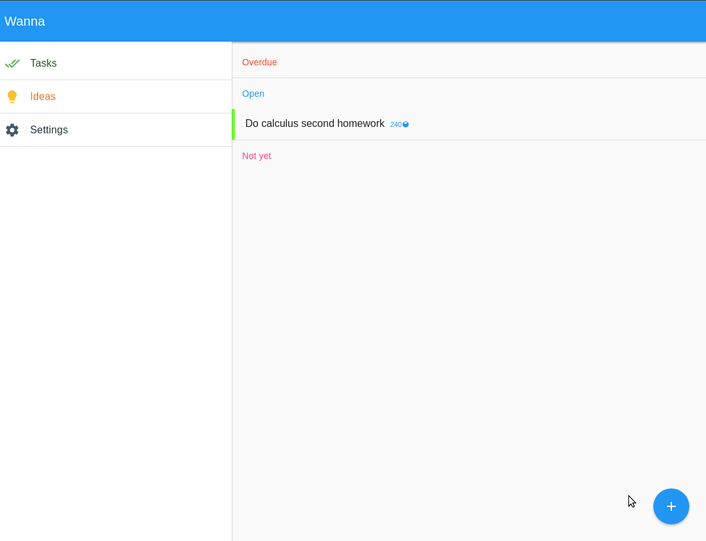

wanna [](https://travis-ci.org/mkermani144/wanna)
====


**_Latest (22 Oct 2016) app look in a thousand of words:_** :sunglasses::sunglasses:




Description
----
Wanna is an alternative to the boring traditional to-do list apps.
It makes you highly flexible, help you manage your time, suggest suitable tasks to do based on your mood, and more.

I hope you enjoy it. Just wait until beta release.


Installation and usage
----
The desktop version of the project is under development at this time and there is no release of the app yet. Everyone can, however, clone the project to see what's going on in the project:
```
git clone https://github.com/mkermani144/wanna.git
```
In order to start the app, you should have `electron` installed on your platform. Then you can easily start the app:
```
cd wanna/desktop
npm install
electron .
```
__Note: The app probably has a mobile version, but it is not ready yet and it's development is not started. My focus is on desktop version at this time.__


Help pages
----
[1.Intro](https://github.com/mkermani144/wanna/tree/master/help/intro.md)  
[2.Task query](https://github.com/mkermani144/wanna/tree/master/help/task_query.md)  
[3.Keyboard shortcuts](https://github.com/mkermani144/wanna/tree/master/help/keyboard_shortcuts.md)


Ideas and features to-do
----
Ideas and features to be developed (sorted based on importance):
####Before [beta release](https://github.com/mkermani144/wanna/milestone/1):

- [X] Priorities
- [X] Time consumption estimation
- [X] Sidenav
- [X] Recurring tasks
- [X] Idea bank
- [X] One-day tasks
- [X] Help pages
- [ ] Github pages

####After beta release:

- [ ] Flexible
- [ ] Timer
- [ ] Moods
- [ ] Job type
- [ ] Daily treshold
- [ ] Time consumption AI
- [ ] Day of thing
- [ ] Projects and subtasks
- [ ] Reports


Technologies
----
- [Electron](http://electron.atom.io)
- [AngularJS](https://angularjs.org)
- [Angular Material](https://material.angularjs.org/)
- [Nedb](https://github.com/louischatriot/nedb)
- [Mocha](https://mochajs.org)
